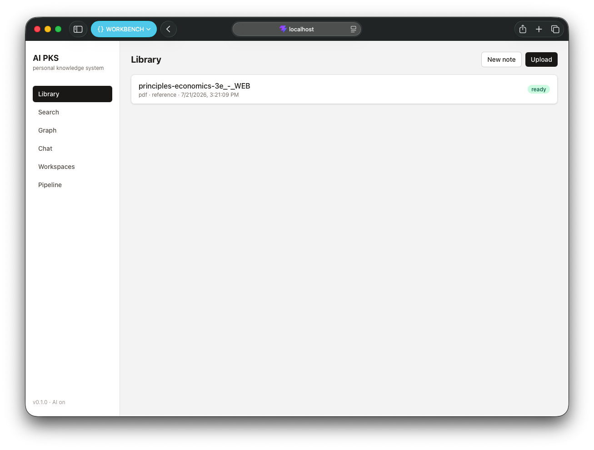
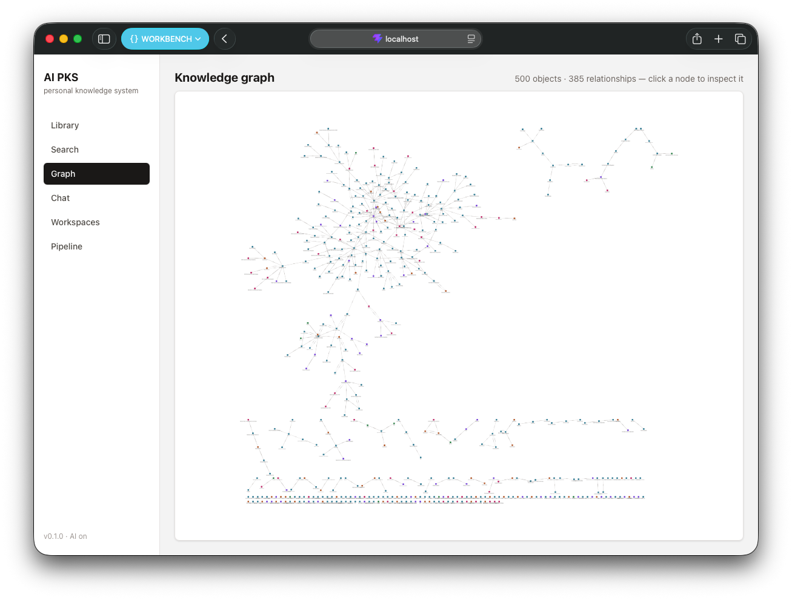
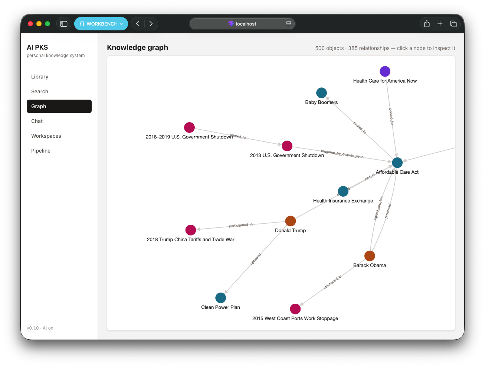
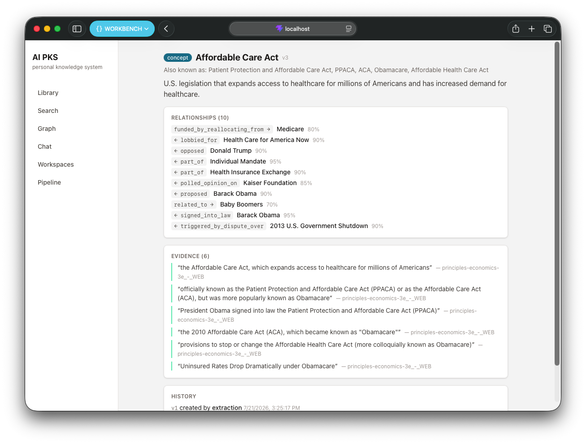
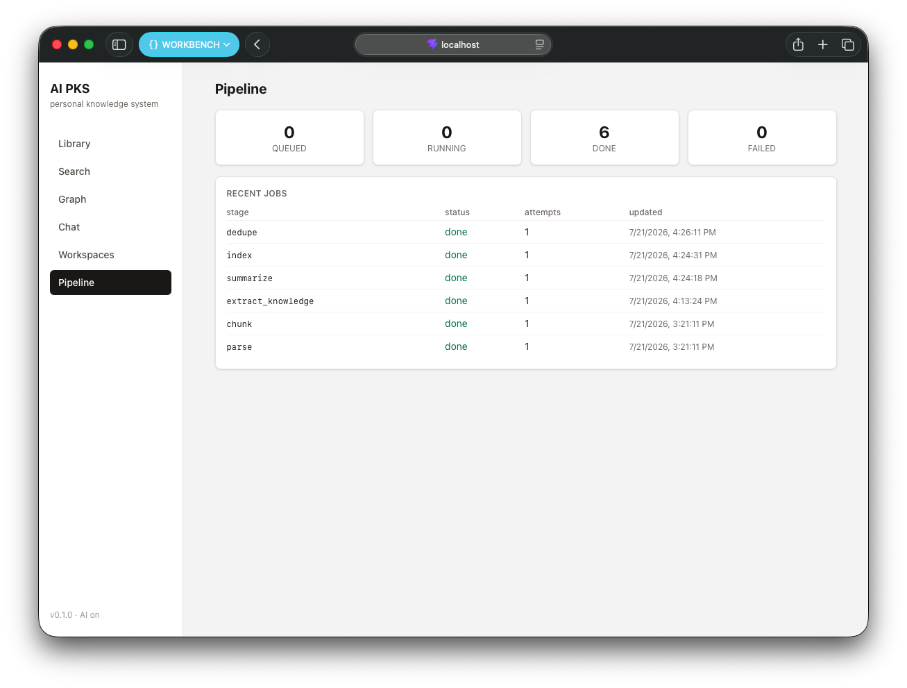

# Cortex — AI Personal Knowledge System

## Project Description

Cortex is a local-first, AI-powered personal knowledge system: upload documents
and write notes, and Cortex automatically turns them into structured, interconnected
knowledge — concepts, people, places, events, summaries — with quote-level
provenance back to the sources. Search it semantically, browse it as a graph,
and chat with it: every answer labels which claims come from *your* knowledge
(with citations) and which from the model.

See [SPEC.md](SPEC.md) for the full product specification and
[ARCHITECTURE.md](ARCHITECTURE.md) for the design.

## Features

- **Ingestion pipeline** — PDF / Markdown / text / notes are parsed, chunked
  along their structure, and processed by AI into knowledge objects with
  relationships, summaries, and verbatim-quote evidence. Durable, retryable
  jobs; content-level dedup.
- **Hybrid search** — local semantic embeddings + full-text keyword search,
  fused by reciprocal rank.
- **Knowledge graph** — typed relationships with confidence, LLM-confirmed
  duplicate merging, revision history on every object.
- **Chat with provenance** — fast-model RAG; answers are segments labeled
  Cortex-backed (numbered citations) or general model knowledge.
- **Workspaces** — contexts that reference knowledge without owning it; scope
  chat and search to a workspace.
- Works without an API key too: parsing, chunking, and search stay functional
  (extraction and chat need AI).

## Tech Stack

- **Backend**: Python 3.12, FastAPI, SQLite (FTS5 + float32-BLOB vectors),
  sentence-transformers (local embeddings), Anthropic API (Claude) behind a
  provider abstraction
- **Frontend**: React 19, TypeScript, Vite, Tailwind CSS, Cytoscape

## Screenshots

*Screens below show a real economics textbook (PDF) ingested end to end.*

**Library** — uploaded resources with live ingestion status. Selecting one reveals its
pipeline stages and structure-aware chunks.



**Knowledge graph** — everything extracted from one textbook: 500 knowledge objects and
385 relationships, color-coded by type.



Zoomed in, the extracted structure is legible — people, events, concepts, and
organizations joined by typed relationships such as `signed_into_law`, `lobbied_for`,
and `triggered_by_dispute_over`.



**Knowledge object** — clicking a node opens its detail: aliases, typed relationships
with confidence scores, verbatim evidence quotes traced back to the source document, and
full revision history.



**Pipeline** — job queue observability: per-status counts and every stage of each
ingestion run (`parse → chunk → extract_knowledge → summarize → index → dedupe`).



## Setup Instructions

Prerequisites: [uv](https://docs.astral.sh/uv/) and Node.js.

```bash
# Backend (http://127.0.0.1:8000)
cd backend
cp .env.example .env          # add ANTHROPIC_API_KEY to enable AI features
uv run uvicorn pks.api.app:app

# Frontend (http://localhost:5173)
cd frontend
npm install
npm run dev
```

Data lives in `backend/data/` (SQLite database + original files). Tests:
`cd backend && uv run pytest`.

## Project Status

V1 complete — all nine milestones (scaffolding → core knowledge engine →
pipeline → AI extraction → search → dedup/graph → chat → workspaces →
frontend → hardening). See [ROADMAP.md](ROADMAP.md) and
[CHANGELOG.md](CHANGELOG.md).

## Contributing

Cortex is a personal project and does **not accept outside pull requests** — sole
copyright is deliberate, so that relicensing stays possible. Bug reports and questions
are welcome via issues. See [CONTRIBUTING.md](CONTRIBUTING.md).

## License

Copyright © 2026 Jason Li.

Cortex is licensed under the **GNU Affero General Public License v3.0 or later**
([LICENSE](LICENSE)). In particular, if you run a modified version of Cortex as a
network service, AGPL §13 requires you to offer its source to that service's users.
